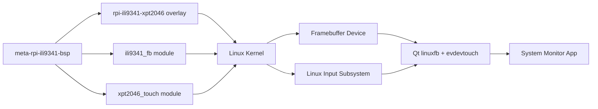

# BSP Bring-Up Flow

This diagram shows the current target-hardware bring-up path at a high level.

```mermaid
flowchart LR
    Layer["meta-rpi-ili9341-bsp"]
    Overlay["rpi-ili9341-xpt2046 overlay"]
    FB["ili9341_fb module"]
    Touch["xpt2046_touch module"]
    Kernel[Linux Kernel]
    FBDev[Framebuffer Device]
    Input[Linux Input Subsystem]
    Qt[Qt linuxfb + evdevtouch]
    App[System Monitor App]

    Layer --> Overlay
    Layer --> FB
    Layer --> Touch
    Overlay --> Kernel
    FB --> Kernel
    Touch --> Kernel
    Kernel --> FBDev
    Kernel --> Input
    FBDev --> Qt
    Input --> Qt
    Qt --> App
```
