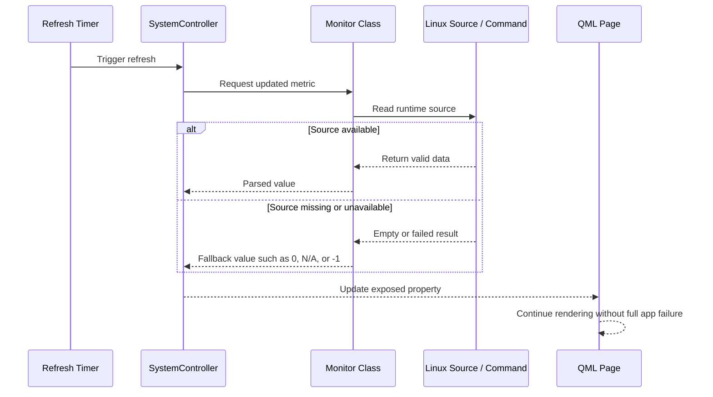

# Degraded Mode Sequence

This sequence shows the intended current fallback behavior when runtime data is missing.

```mermaid
sequenceDiagram
    participant Timer as Refresh Timer
    participant Ctrl as SystemController
    participant Model as Monitor Class
    participant Source as Linux Source / Command
    participant QML as QML Page

    Timer->>Ctrl: Trigger refresh
    Ctrl->>Model: Request updated metric
    Model->>Source: Read runtime source
    alt Source available
        Source-->>Model: Return valid data
        Model-->>Ctrl: Parsed value
    else Source missing or unavailable
        Source-->>Model: Empty or failed result
        Model-->>Ctrl: Fallback value such as 0, N/A, or -1
    end
    Ctrl-->>QML: Update exposed property
    QML-->>QML: Continue rendering without full app failure
```
