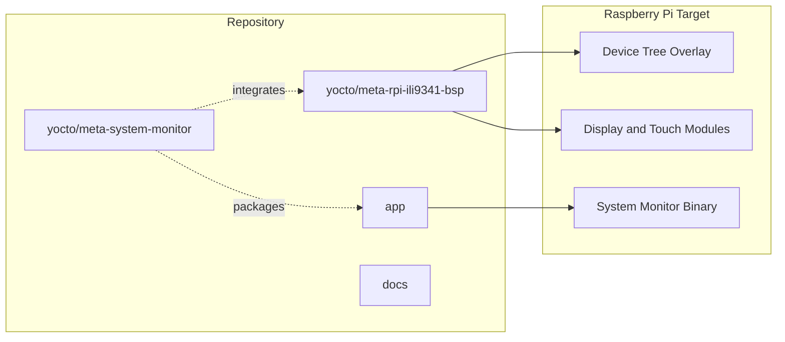

# Packaging And Deployment Diagram

This diagram focuses on repository-level packaging and deployment relationships.

```mermaid
flowchart LR
    subgraph Repo[Repository]
        App[app]
        BSP[yocto/meta-rpi-ili9341-bsp]
        Product[yocto/meta-system-monitor]
        Docs[docs]
    end

    subgraph Target[Raspberry Pi Target]
        Overlay[Device Tree Overlay]
        Modules[Display and Touch Modules]
        Binary[System Monitor Binary]
    end

    Product -. packages .-> App
    Product -. integrates .-> BSP
    BSP --> Overlay
    BSP --> Modules
    App --> Binary
```
