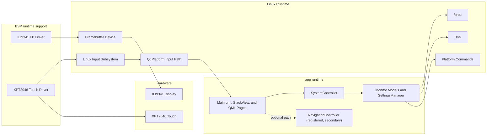

# Runtime Component Diagram

This diagram focuses on current runtime relationships only.

```mermaid
flowchart LR
    subgraph App[app runtime]
        QML["Main.qml, StackView, and QML Pages"]
        Ctrl[SystemController]
        Nav["NavigationController (registered, secondary)"]
        Models[Monitor Models and SettingsManager]
    end

    subgraph Runtime[Linux Runtime]
        Proc["/proc"]
        Sys["/sys"]
        Cmd[Platform Commands]
        Input[Linux Input Subsystem]
        FBDev[Framebuffer Device]
        QtInput[Qt Platform Input Path]
    end

    subgraph BSP[BSP runtime support]
        FB[ILI9341 FB Driver]
        Touch[XPT2046 Touch Driver]
    end

    subgraph HW[Hardware]
        Display[ILI9341 Display]
        Pen[XPT2046 Touch]
    end

    QML --> Ctrl
    QML -. optional path .-> Nav
    Ctrl --> Models
    Models --> Proc
    Models --> Sys
    Models --> Cmd

    Touch --> Input
    Input --> QtInput
    QtInput --> QML

    FB --> FBDev
    FBDev --> Display
    Touch --> Pen
```
