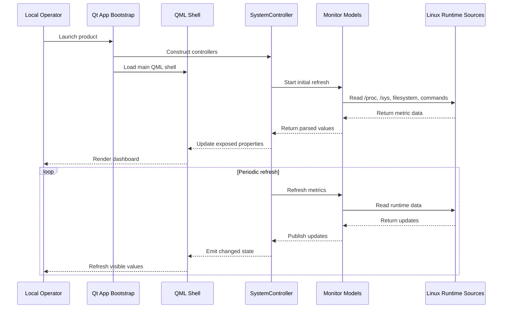

# Sequence Diagram

The primary sequence below models startup and periodic refresh.

```mermaid
sequenceDiagram
    participant User as Local Operator
    participant Qt as Qt App Bootstrap
    participant QML as QML Shell
    participant Ctrl as SystemController
    participant Models as Monitor Models
    participant Linux as Linux Runtime Sources

    User->>Qt: Launch product
    Qt->>Ctrl: Construct controllers
    Qt->>QML: Load main QML shell
    Ctrl->>Models: Start initial refresh
    Models->>Linux: Read /proc, /sys, filesystem, commands
    Linux-->>Models: Return metric data
    Models-->>Ctrl: Return parsed values
    Ctrl-->>QML: Update exposed properties
    QML-->>User: Render dashboard

    loop Periodic refresh
        Ctrl->>Models: Refresh metrics
        Models->>Linux: Read runtime data
        Linux-->>Models: Return updates
        Models-->>Ctrl: Publish updates
        Ctrl-->>QML: Emit changed state
        QML-->>User: Refresh visible values
    end
```
