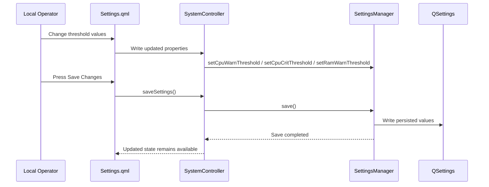

# Settings Persistence Sequence

This sequence shows the current supported save path for settings persistence.

```mermaid
sequenceDiagram
    participant User as Local Operator
    participant QML as Settings.qml
    participant Ctrl as SystemController
    participant Settings as SettingsManager
    participant Store as QSettings

    User->>QML: Change threshold values
    QML->>Ctrl: Write updated properties
    Ctrl->>Settings: setCpuWarnThreshold / setCpuCritThreshold / setRamWarnThreshold
    User->>QML: Press Save Changes
    QML->>Ctrl: saveSettings()
    Ctrl->>Settings: save()
    Settings->>Store: Write persisted values
    Settings-->>Ctrl: Save completed
    Ctrl-->>QML: Updated state remains available
```
