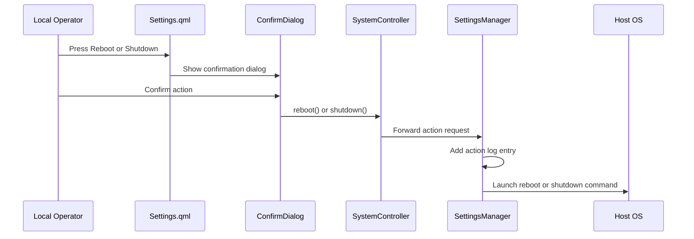

# System Actions Sequence

This sequence shows the current reboot and shutdown action handoff.

```mermaid
sequenceDiagram
    participant User as Local Operator
    participant QML as Settings.qml
    participant Dialog as ConfirmDialog
    participant Ctrl as SystemController
    participant Settings as SettingsManager
    participant OS as Host OS

    User->>QML: Press Reboot or Shutdown
    QML->>Dialog: Show confirmation dialog
    User->>Dialog: Confirm action
    Dialog->>Ctrl: reboot() or shutdown()
    Ctrl->>Settings: Forward action request
    Settings->>Settings: Add action log entry
    Settings->>OS: Launch reboot or shutdown command
```
