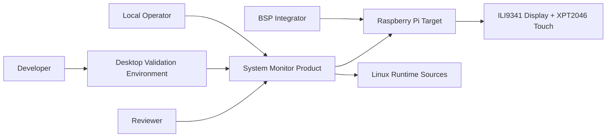

# System Context Diagram

This diagram shows the product in its operating and engineering context.

```mermaid
flowchart LR
    Operator[Local Operator]
    Developer[Developer]
    Integrator[BSP Integrator]
    Reviewer[Reviewer]

    Product[System Monitor Product]

    Desktop[Desktop Validation Environment]
    Target[Raspberry Pi Target]
    HW["ILI9341 Display + XPT2046 Touch"]
    Linux[Linux Runtime Sources]

    Operator --> Product
    Developer --> Desktop
    Desktop --> Product
    Integrator --> Target
    Target --> HW
    Product --> Linux
    Product --> Target
    Reviewer --> Product
```
