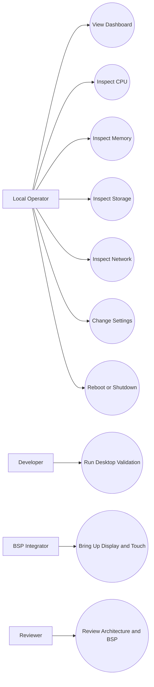

# Use Case Diagram

```mermaid
flowchart LR
    Operator[Local Operator]
    Developer[Developer]
    Integrator[BSP Integrator]
    Reviewer[Reviewer]

    UC1((View Dashboard))
    UC2((Inspect CPU))
    UC3((Inspect Memory))
    UC4((Inspect Storage))
    UC5((Inspect Network))
    UC6((Change Settings))
    UC7((Reboot or Shutdown))
    UC8((Run Desktop Validation))
    UC9((Bring Up Display and Touch))
    UC10((Review Architecture and BSP))

    Operator --> UC1
    Operator --> UC2
    Operator --> UC3
    Operator --> UC4
    Operator --> UC5
    Operator --> UC6
    Operator --> UC7

    Developer --> UC8
    Integrator --> UC9
    Reviewer --> UC10
```
