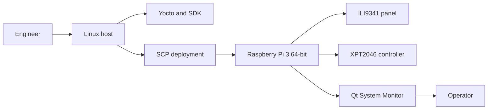
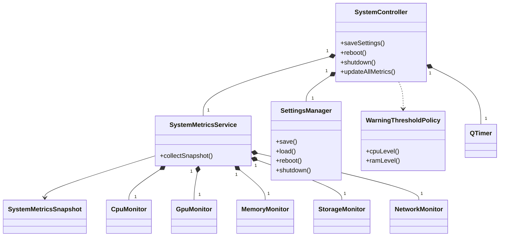
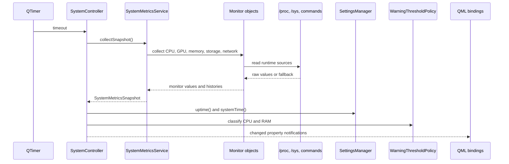
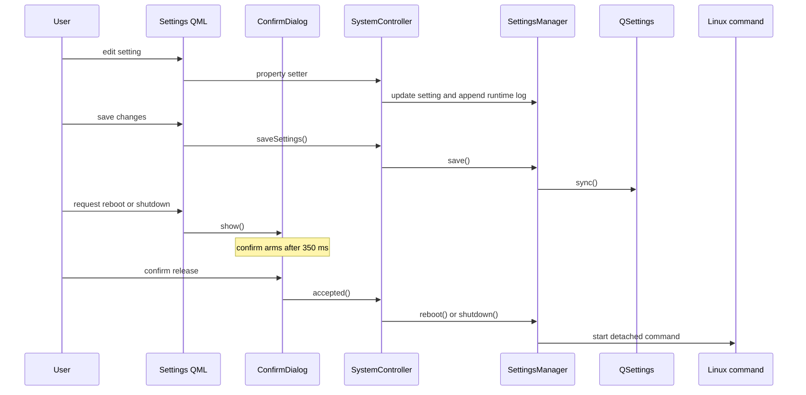
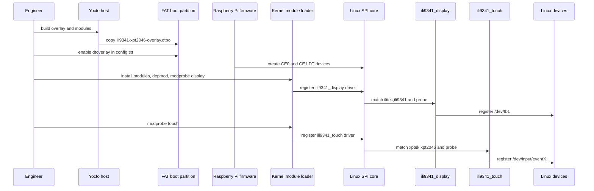
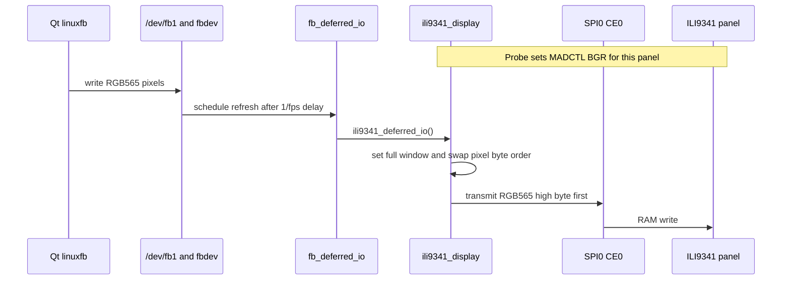
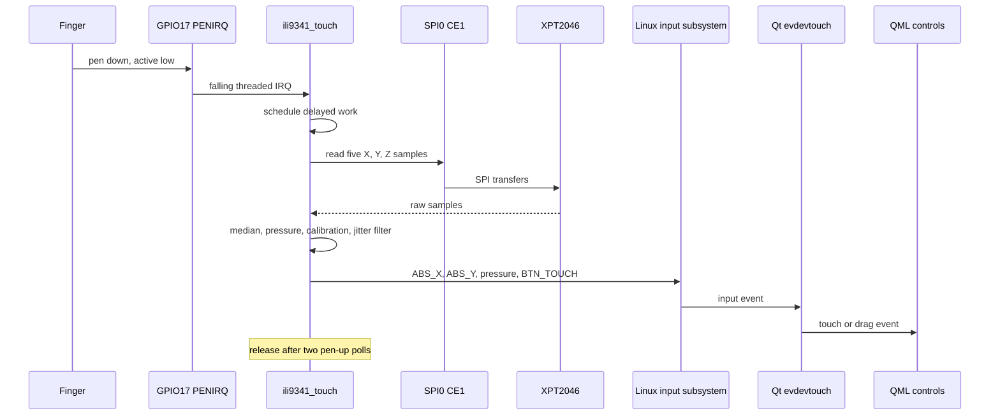

# Diagrams

These diagrams describe the manual Raspberry Pi bring-up workflow. Flowcharts
show context and runtime layers. The class and sequence diagrams are UML-style
views derived from the current source.

## 1. System Context

## 2. Application and Linux Runtime Layers

```mermaid
flowchart TB
    QML["QML pages and components"] --> Facade["SystemController: systemInfo"]
    Facade --> Metrics["SystemMetricsService"]
    Facade --> Settings["SettingsManager"]
    Facade --> Policy["WarningThresholdPolicy"]
    Metrics --> Monitors["CPU, GPU, memory, storage, network monitors"]
    Monitors --> Sources["Linux sources: /proc, /sys, commands"]
    Settings --> Store["QSettings and system commands"]

    QML --> LinuxFB["Qt linuxfb: /dev/fb1"]
    LinuxFB --> DisplayDriver["ili9341_display"]
    TouchDriver["ili9341_touch"] --> Input["Linux input event"]
    Input --> Evdev["Qt evdevtouch"]
    Evdev --> QML
```

## 3. Application Class View

## 4. Metric Refresh Sequence

## 5. Settings and Guarded System Action

## 6. BSP Bind and Manual Deployment

## 7. Display Flush Sequence

## 8. Touch Input Sequence

