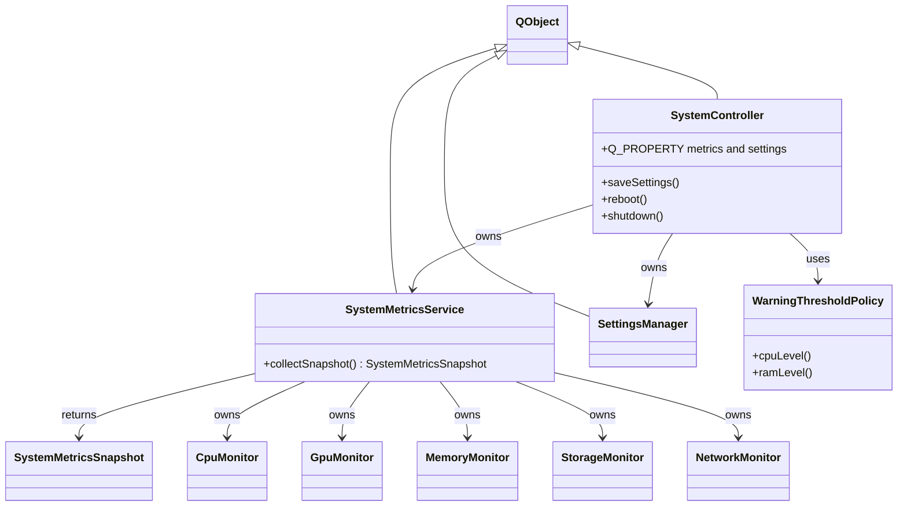
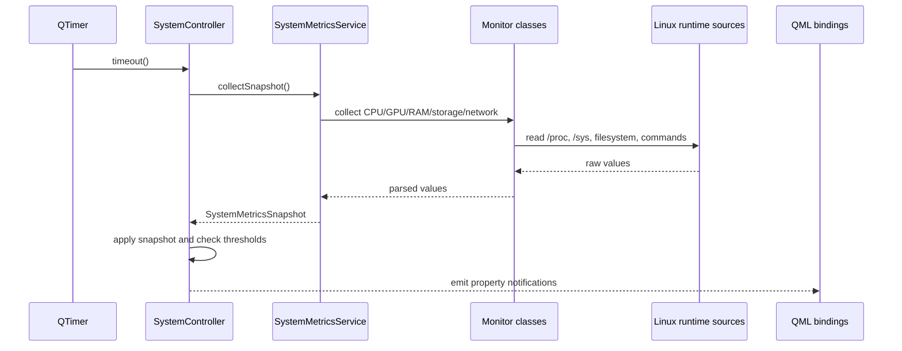
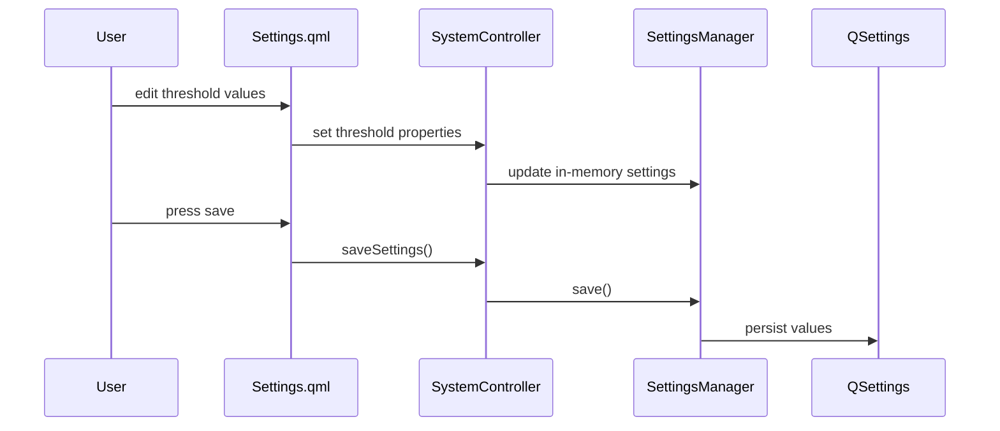

# Diagrams

These diagrams are intentionally few and practical. `classDiagram` and `sequenceDiagram` entries are UML-style Mermaid diagrams; flowcharts are not claimed as UML.

## System Context

Flowchart for product-level context.

```mermaid
flowchart LR
    User[Local operator] --> App[Qt/QML System Monitor]
    App --> Linux[Linux runtime sources]
    App --> FB[/dev/fb*]
    App --> Input[/dev/input/event*]
    BSP[Yocto BSP layer] --> FB
    BSP --> Input
    HW[ILI9341 display and XPT2046 touch] --> BSP
```

## Runtime Layers

Flowchart for implemented runtime ownership.

```mermaid
flowchart TD
    QML[QML pages and components] --> Facade[SystemController QML facade]
    Facade --> Service[SystemMetricsService]
    Facade --> Settings[SettingsManager]
    Facade --> Policy[WarningThresholdPolicy]
    Service --> Snapshot[SystemMetricsSnapshot DTOs]
    Service --> Monitors[CPU GPU Memory Storage Network monitors]
    Monitors --> Platform[/proc /sys statvfs QProcess commands]
```

## Backend Class Relationships

UML-style Mermaid class diagram for core C++ relationships.



## Metric Update Flow

UML-style sequence diagram for the periodic refresh path.



## Settings Save Flow

UML-style sequence diagram for persisted settings.



## Display And Touch Bring-Up

Flowchart for target BSP path.

```mermaid
flowchart LR
    Overlay[Device tree overlay] --> SPI[SPI0 enabled]
    SPI --> DisplayNode[ILI9341 on CS0]
    SPI --> TouchNode[XPT2046 on CS1]
    DisplayNode --> DisplayDriver[ili9341_fb module]
    TouchNode --> TouchDriver[xpt2046_touch module]
    DisplayDriver --> FB[/dev/fb*]
    TouchDriver --> Event[/dev/input/event*]
    FB --> Qt[Qt framebuffer rendering]
    Event --> QtInput[Qt evdev touch input]
```
